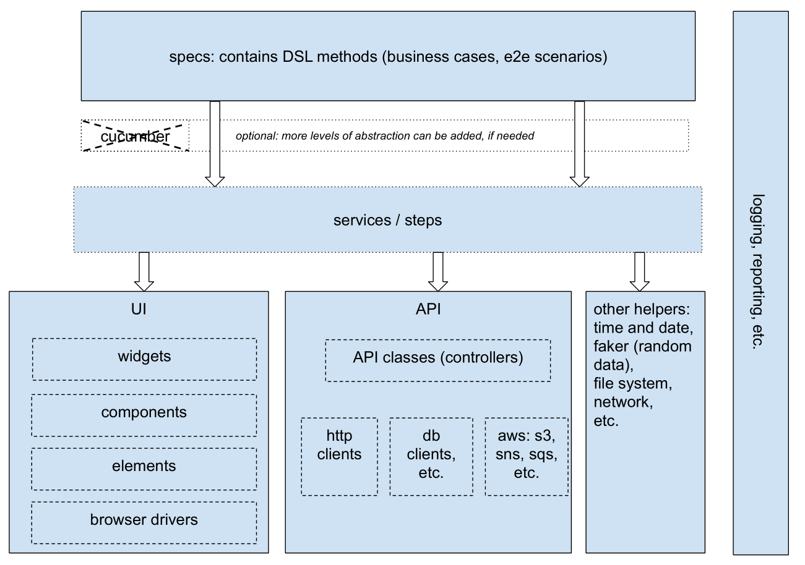
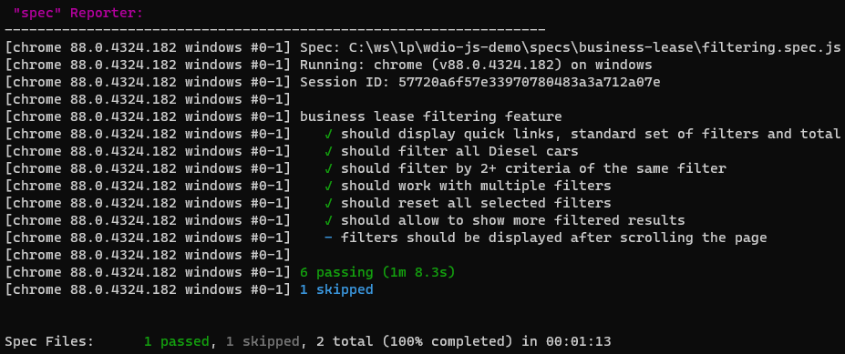
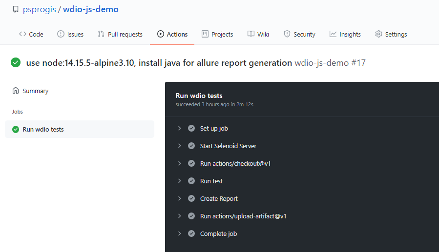

This repo contains examples of a filtering tests for [LeasePlan business showroom page](https://www.leaseplan.com/en-be/business/showroom/).  
Tools:
- [webdriver.io@7](https://webdriver.io/)
- [mocha](https://mochajs.org/) and built-in [expect](https://webdriver.io/docs/api/expect-webdriverio/).
- CI: [github actions](https://github.com/features/actions), [gitlab](https://gitlab.com/).
- reporting: [allure](http://allure.qatools.ru/), [spec](https://webdriver.io/docs/spec-reporter)
- [eslint](https://eslint.org/) with [wdio-plugin](https://www.npmjs.com/package/eslint-plugin-wdio).  
- [log4js](https://log4js-node.github.io/log4js-node/) for logging.

## Table of Contents
1. [General automation overview](#general-automation-overview)
2. [Local run](#local-run)
    1. [Preconditions and environment](#preconditions-and-environment)
    2. [How to run](#how-to-run)
    3. [Report](#report)   
3. [Run on CI](#run-on-ci)
    1. [Run on gitlab](#run-on-gitlab)
    2. [Run on github actions](#run-on-github-actions)
5. [TODO](#todo)

## General automation overview
The following chart describes typical automation "framework" building blocks:

[original file on a google drive](https://docs.google.com/drawings/d/1qBoop81kclCIlnatuc5pULY_7pAlh3nD3PX2sYrv6j4/edit?usp=sharing)  
Key features:
- high-level, clear, readable, easy to understand, verbose specs. Contains only test logic (business cases). Do not contain any webdriver (other frameworks) calls and low-level methods.
- decoupled test logic, test data, and implementation (work with the browser, network, database, etc).
- services layer: expose only high-level methods (public API). Hide (encapsulate) all interaction with the driver, (ideally, for e2e tests) do not return web elements.
- easier to maintain and reuse code, e.g. service or UI component can update/change an internal login flow w/o affecting spec file.
- has rich UI components library: most of the widgets/components on frontend side should have representative class to use in automation. Complex components are built on top of the simple ones. 

## Local run
### Preconditions and environment
* Test should work on any linux/unix (CentOS, RedHat, Fedora, etc.) and Windows 10
* node.js version v14.15.5 (or higher)
```bash
node -v
v14.15.5
```
* npm version 6.14.8. (package lock will be ignored with npm v less than 5)
```bash
npm -v
6.14.8
```
Note: do not use npm 7+, it is still unstable and has some compatibility issues, e.g. `package-lock` breaking changes.
* optional, if you prefer to run selenium-standalone instead of [chromedriver service](https://webdriver.io/docs/wdio-chromedriver-service/):
    * jdk11+, java also required to generate allure report locally.
    * python3 and VSBuild tools since wdio works with fibers (will be installed during node.js installation). You should not do any additional installation with node14+, but if you get the following errors:
    ```bash
    MSBUILD : error MSB3428: Could not load the Visual C++ component "VCBuild.exe". To fix this, 1) install the .NET Framework 2.0 SDK, 2) install Microsoft Visual Studio 2005 or 3) add the location of the component to the system path if it is installed elsewhere.
    Failed at the fibers@5.0.0 install script
    ```
    Follow the [instructions](https://github.com/nodejs/node-gyp#on-unix) to fix this.
    * webdriver-manager,
    run `webdriver-manager update` to get the latest versions of drivers
    ```bash
    npm i -g webdriver-manager
    webdriver-manager update
    # status after update
    webdriver-manager status
    [18:05:42] I/status - selenium standalone version available: 3.141.59 [last]
    [18:05:42] I/status - chromedriver versions available: 84.0.4147.30, 85.0.4183.87, 86.0.4240.22, 87.0.4280.88, 88.0.4324.96 [last]
    [18:05:42] I/status - geckodriver versions available: v0.27.0, v0.29.0 [last]
    [18:05:42] I/status - IEDriverServer is not present
    [18:05:42] I/status - android-sdk is not present
    [18:05:42] I/status - appium is not present
    ```

### How to run
```bash
cd wdio-js-demo/
npm i
# ...
npm t
# ...
npm run report
# ...
Report successfully generated to allure-report
Starting web server...
# ...
```

### Report
For automation engineer needs spec report is 100% enough, but to track statistics and for managers and other stakeholders I use industry-standard - [Allure Report](https://demo.qameta.io/allure/)  
!insert allure report!.

## Run on CI
### Run on gitlab
[gitlab project](https://gitlab.com/psprogis/wdio-js-demo), not stable yet.  
!insert screenshots!

### Run on github actions

You can find more information about each run on [Actions tab](https://github.com/psprogis/wdio-js-demo/actions) in github

## Todo
- add allure [steps](https://webdriver.io/docs/allure-reporter).
  We cannot mess up components methods with steps, so it should be a new Proxy object or "steps" module that wraps up all high-level calls.  
  see example in steps folder.
- start selenoid on gitlab, instead of selenium standalone service.
- implement more UI components/widget: MonthlyPriceFilter, MoreFilters filter, etc.
- cleanup gitlab stages: start gitlab local runner and debug all the issues.
- gitlab: post results to [allure server](https://github.com/kochetkov-ma/allure-server), use nginx or find another way to serve report.  
- (minor) eslint default parser does not work with static properties, fix configuration with babel-parser.
